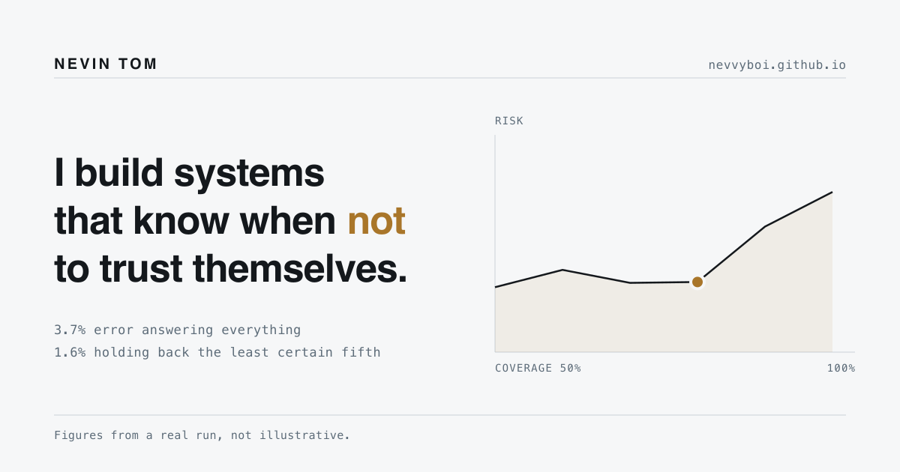
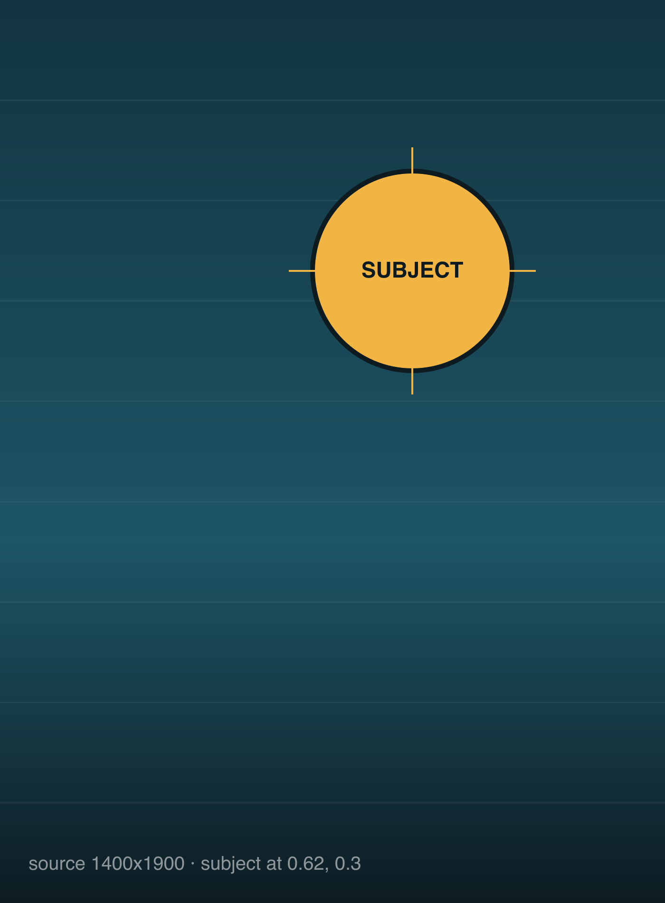
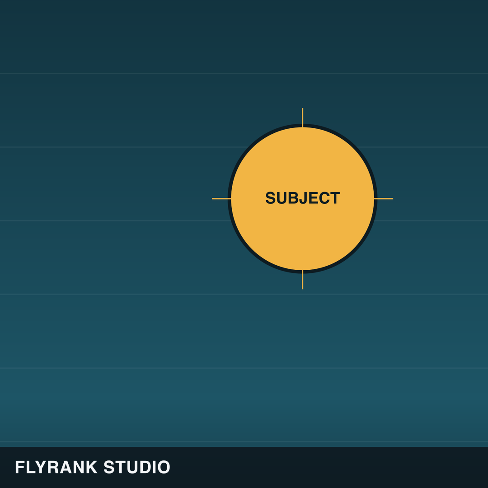
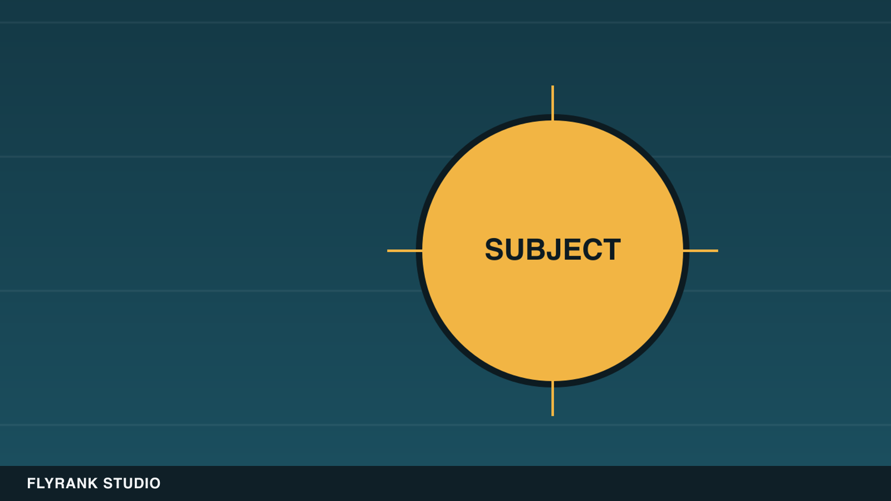
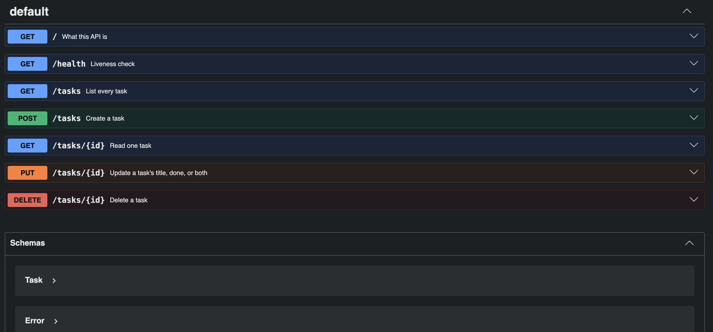

# Kill Your Darlings: Curating the Images

**AI Fluency, Week 3 | Nevin Tom**

---

## What the site actually needs

Worked out from the [content map](06-through-line-content-map.md) rather than
from a general sense that a portfolio should have pictures.

| Where | What it needs | Real or generated | Status |
|---|---|---|---|
| Hero | The risk-coverage curve | **Neither.** Live SVG drawn from `metrics.json` at page load | shipped |
| Browser tab | A mark | Generated by hand as SVG, 4 lines | shipped |
| Link previews | A share card | Generated from the site's own tokens and the same data | shipped |
| Case: defect inspector | Nothing | The curve above already is the evidence | deliberately none |
| Case: social media studio | Platform variants | **Real output** of the pipeline | in the repo |
| Case: task API | The running service | **Real screenshot** | in the repo |
| About | A photo of me | Real, or nothing | **nothing, see below** |

Seven slots. One live SVG, two things I drew, two real captures, and two
deliberate absences.

## The keepers

**1. The hero, which is not an image.**

The most important visual on the site is an inline SVG whose path is computed
in the browser from six rows of `outputs/metrics.json`. Dragging the slider
moves the operating point along it.

This is the one call I would defend before any other. A screenshot of a chart
is a picture of a fact. A chart drawn from the data at load time is the fact.
Anyone who doubts a number can read the array in the page source, and the
distance between "I measured this" and "you can check I measured this" is the
whole argument of the site.

**2. The favicon.** Four lines of SVG, inline as a data URI: the same curve,
flat then rising, amber dot at the operating point. Details in
[the identity kit](04-identity-kit.md).

**3. The share card**, `images/share-card.png`, 1200x630.

Generated by `assets/make-share-card.js`, which reads the same six operating
points the hero plots and the same six colour tokens. It is a picture, but it
is not a picture of nothing: the curve on it is the run.

Before this, links to the site produced a bare grey rectangle everywhere they
were pasted, which was the single largest gap between how the site reads and
how it travels.

**4 and 5. Platform variants**, real output from the studio's pipeline.

| | |
|---|---|
| source, 1400x1900 |  |
| instagram, 1080x1080 |  |
| x, 1600x900 |  |

These are not mockups of a feature. They are what the code emitted, and the
crosshair exists so a reader can see where each crop put the subject rather
than take my word that the safe zone logic works.

**6. The task API, running.**

A screenshot of Swagger UI against the live container, taken while it was up.
Cropped to the endpoint list, legible at the width it is displayed.

## What I rejected, and why

**A generated hero texture.** The obvious move: some soft abstract gradient or
a wireframe mesh behind the headline, in the palette, to stop the top of the
page looking bare.

I generated options and rejected all of them, and the reason is not taste. The
hero already contains the one thing on this site that carries the argument, a
plot of real measurements you can drag. Putting a decorative texture behind it
means the first thing a visitor's eye resolves is a thing I made up, sitting
directly behind a thing I measured. On a page whose entire claim is that the
figures are real and not illustrative, that is not a neutral decision. It is
the page undermining itself for atmosphere.

The bareness is the point. Off-white, one headline, one plot.

**A generated portrait, or a stock photo of a person at a laptop.** The About
section has no image and will not have one until there is a real photograph of
me that I am happy to publish. A generated portrait of a person who does not
exist, on a page claiming to be about a specific person, is the single most
self-defeating image a portfolio can carry. A stock photo is the same failure
with a licence attached.

Until then the slot stays empty, which reads as restrained rather than as
missing, because everything around it is restrained too.

**Generated icons for the project list.** I tried a small mark per project.
They looked consistent and told the reader nothing: six abstract glyphs that
could be attached to any six projects in any order. The project titles already
do the work, and six icons would have been six more things competing with the
one plot.

**A screenshot of code.** Tempting for the scraper and the studio cases, and
wrong. Code as an image is unreadable on a phone, unsearchable, uncopyable, and
inaccessible to a screen reader. Both cases link to the repository instead,
where the code is code.

## The discernment, stated plainly

The rule I ended up applying: **generate the connective tissue, never the
evidence.**

The share card and the favicon are connective tissue. They exist so the site
travels and so the tab is identifiable, and they were made from the site's own
tokens so they carry its style rather than a generator's. Everything that
functions as proof, the curve, the platform variants, the running service, is
real output, and where I could not get a real one, the slot is empty.

The tell is a question worth asking of any image on a portfolio: *if a reader
found out this picture was generated, would it change what they believe about
the work?* For the share card, no. For the hero, yes, completely. That question
sorted every image on this page.

## What is still missing

Named rather than quietly absent:

- **A real photograph of me.** The About section stays empty until there is one.
- **The scraper has no visual at all.** Its evidence is a run report, which is
  JSON. A rendered before-and-after of the 0.1 KB against 112.4 KB second run
  would help, and I have not made it.
- **The screenshots are light mode only.** They were taken on a light system
  and would need retaking on a dark one to match a dark-mode reader.

---

*Palette and type these were built from: [the identity kit](04-identity-kit.md).*
